<div align="center">

</div>

<br/>

```console
ysa@nomad:~$ ./ysa.sh --help

ysa.sh — introduction script
(yes, my initials are also a shell script extension. not an accident.)

Usage: ./ysa.sh [command]
```

<br/>

```console
ysa@nomad:~$ cat about-me.txt
```

> Senior frontend developer with **10+ years** of experience, specialized in **Vue.js**.
> 100% remote freelancer, working for several clients at the same time as their only frontend dev.
>
> But I do not just write code for others: **I build, ship and sell my own apps**.
> That is the part of the `PATH` I like most.
>
> Right now: Vue 3 + TypeScript by day, React Native + AI by night. Vigo, Spain.

<br/>

```console
ysa@nomad:~$ ls -la ~/projects
```

| permissions | project | description |
|---|---|---|
| `-rwx r--` | **[Digi TCG Scan](https://digitcgscan.app)** | Scan your TCG cards with the camera and track their price in real time. Manage your collection and know what it is worth. Live on the App Store and Google Play. |
| `-rwx r--` | **[topdeck.me](https://topdeck.me)** | Deck matchmaker: profiles your playstyle in 5 questions and tells you which deck from the current meta you should play — and which version of it. |
| `-rwx r--` | **[ScriptOutlier](https://scriptoutlier.com)** | Helps YouTube creators write scripts that retain: hooks, structure and pacing. |
| `drwx ---` | `wip/` | There is always something compiling in here. 👀 |

<br/>

```console
ysa@nomad:~$ cat experience.log
```

```log
[2026-03 → now]  Turing Challenge SL   Senior Frontend Vue.js. Complex SPAs and dashboards in Vue 3 + TS.
                                       pdf.js with BoundingBox deep-linking, MSAL/Entra ID, Azure SWA.
[2025-04 → now]  Bill-y                Sole frontend dev. Own the architecture and all frontend decisions.
[2023-10 → now]  Factura X             Sole frontend dev. Full cycle: architecture → production.
[2022-02 → now]  Axteroid              Sole frontend dev. Multiple web apps running in production.
[2021-04 → 2022] Talana                Led frontend re-engineering: -40% redundant code. Mentored the
                                       team on SOLID/Clean Code, reviewed and approved MRs.
[2020-05 → 2021] Piriod                Migrated UIV/Bootstrap → Vuetify in one month. CSV/XLSX/JSON
                                       import-export system and metrics dashboard.
[2020]           Rama Judicial (CO)    SPA with 7 query types over an evolving API (v1 → v2).
[2019-07 → 2019] Lirmi                 EdTech SaaS across LATAM. i18n, analytics, pixel-perfect views.
[2019]           DIAN (CO)             Auth system and financial API integration.
[2013 → 2018]    Consejo Legislativo   Institutional web portal: PHP, MySQL, migration to WordPress.
                 del Estado Sucre
```

<br/>

```console
ysa@nomad:~$ tree ~/skills
```

```text
~/skills
├── frontend/
│   ├── Vue.js (2/3) · Composition API · Pinia · Vuex · Vue Router
│   ├── TypeScript · JavaScript · HTML5 · CSS3 · SASS/SCSS
│   ├── Vuetify · Bootstrap · Responsive Web Design · Pixel Perfect
│   └── Testing · Vue Test Utils
├── mobile/
│   └── React Native · Expo · EAS Build · ML Kit OCR
├── backend/
│   ├── Node.js · Express.js · RESTful APIs · Cron Jobs
│   └── PostgreSQL · MongoDB/Mongoose
├── ai-ml/
│   ├── Computer Vision · OpenCV · ML Kit · AI Embeddings (Voyage AI)
│   ├── OpenAI · Anthropic Claude · Google Cloud Vision
│   └── Prompt Engineering · LLM workflow automation · AI-assisted code review
├── auth/
│   └── MSAL (Microsoft Entra ID) · Supabase Auth · JWT
├── infra-and-tools/
│   ├── Git · GitHub · GitLab · Azure DevOps
│   ├── Azure Static Web Apps · AWS S3 · Supabase · Railway
│   └── Vite · Webpack · NPM/Yarn · Next.js
├── design/
│   └── Figma · Prototyping · UI/UX Design
├── i18n/
│   └── Internationalization · multi-language apps
├── methodologies/
│   └── Scrum · Kanban · Clean Code · SOLID
└── soft-skills/
    ├── Technical leadership and mentoring
    ├── Autonomous management of parallel client projects
    ├── Problem solving, debugging and performance optimization
    └── Cross-functional communication (design · backend · product)
```

<br/>

```console
ysa@nomad:~$ echo $STACK
```

`Vue 3` `TypeScript` `Vuetify` `Pinia` `React Native` `Expo` `Node.js` `Express` `PostgreSQL` `Azure` `Claude Code` `AI agents`

<br/>

```console
ysa@nomad:~$ crontab -l
```

```bash
# min hour what
0 9 * * 1-5 code --clients # Vue/TS frontend across several projects at once
0 18 * * * ./build-indie.sh # my own apps, from idea to production
0 21 * * 3,6 ship --side-projects # whatever I am building on my own
* * * * * learn --something-new # this job never finishes, and that is fine
```

<br/>

```console
ysa@nomad:~$ exit
# thanks for reading all the way down. exit 0 ✨
```
